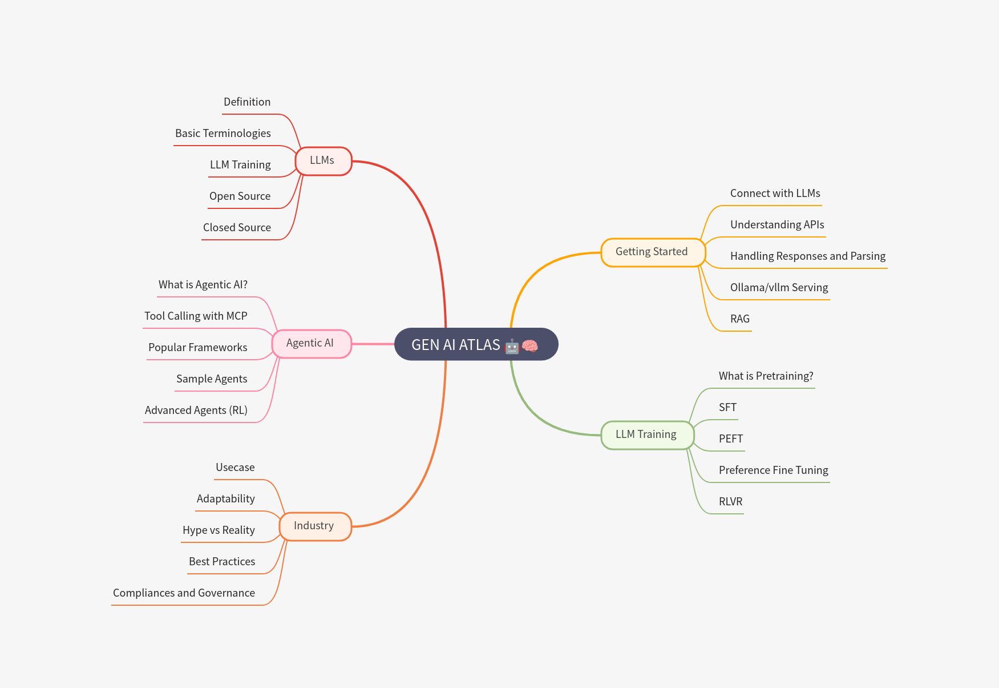

# 🌌 GenAI-Atlas  
*A community-driven roadmap and resource hub for Generative AI, LLMs, and Agentic AI*  

  

---

## 📌 About
Generative AI is evolving at lightning speed. This project aims to create a **structured, open-source hub** where anyone can:  
- Learn the fundamentals of **LLMs, Agentic AI, and fine-tuning**  
- Explore curated **resources, tutorials, and Jupyter notebooks**  
- Build **real-world mini-projects** with step-by-step guides  
- Collaborate and **contribute new knowledge back to the community**  

Our mission is to **simplify the chaos** of the GenAI ecosystem into a clear, actionable roadmap for both **beginners** and **practitioners**.  

---

### Repository Structure

This atlas is organized to help you navigate from foundational concepts to hands-on applications.

### 📚 Learning & Guides

* **[`tutorials/`](tutorials/)**
    > In-depth explanations, step-by-step guides, and how-tos on core Generative AI topics. Perfect for understanding the "why" and "how" behind the technology.

* **[`notebooks/`](notebooks/)**
    > Interactive code demos and runnable examples. These Colab and Jupyter notebooks are designed for hands-on learning, letting you see the concepts in action.

* **[`resources/`](resources/)**
    > A curated collection of the best external resources. Find links to foundational research papers, insightful blog posts, influential talks, and educational videos.

### 🚀 Projects & Examples

* **[`examples/`](examples/)**
    > A showcase of mini-projects and applied learning examples. Each folder contains a self-contained project to demonstrate specific Generative AI use cases.

### 📖 Documentation & Community

* **[`docs/`](docs/)**
    > Visual aids and supplementary materials. This includes high-level diagrams, flowcharts, visual explainers, and an FAQ section to answer common questions.

* **[`community/`](community/)**
    > A space to connect with fellow learners and contributors. Find discussions, a list of our amazing contributors, and a platform for suggesting new project ideas.

---

### Get Involved

We believe in the power of open collaboration. Whether you're a seasoned expert or just starting out, your contributions are welcome!

* **Contribute:** Check out our [Contribution Guidelines](CONTRIBUTING.md) to get started.
* **Explore:** Dive into a section above and start your journey.
* **Connect:** Join the discussion in the [Community](community/) folder.
